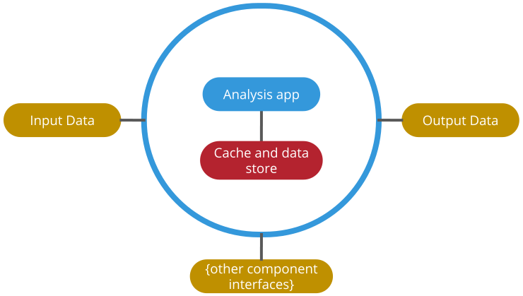
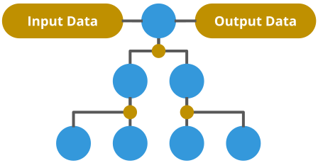

.. _digital_twins:

=============
Digital Twins
=============

A digital twin is a virtual representation of a real life being - a physical asset like a wind turbine or car - or even
a human.

There are three reasons why you might want to create a digital twin:
    - Monitoring
    - Prediction
    - Optimisation

On its own, a digital twin can be quite useful. For example, a twin might embody an AI-based analysis to predict power
output of a turbine.

    A digital twin consists of some kind of analysis or processing task, which could be run many times per second, or
    daily, down to occasionally or sometimes only once (the same as a "normal" analysis).

Coupling digital twins is generally even more useful. You might wish to couple your turbine twin with a representation
of the local power grid, and a representation of a factory building to determine power demand... enabling you to
optimise your factory plant for lowest energy cost whilst intelligently selling surplus power to the grid.

    A hierarchy of digital twins. Each blue circle represents a twin, coupled to its neighbours. Yellow nodes are where
    schema are used to connect twins.

.. _gemini_principles:

Gemini Principles
=================

The Gemini Principles have been derived by the
`Centre for Digital Built Britain (CDBB) <https://www.cdbb.cam.ac.uk/system/files/documents/TheGeminiPrinciples.pdf>`_.
We strongly recommend you give them a read if embarking on a digital twins project.

The aim of **twined** is to enable the following principles. In particular:

#. Openness (open-source project to create schema for twins that can be run anywhere, anywhen)
#. Federation (encouraging a standardised way of connecting twins together)
#. Security (making sure schemas and data can be read safely)
#. Public Good (see our nano-rant about climate change in :ref:`reason_for_being`)

