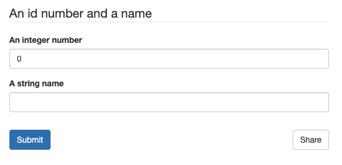

.. _introducing_json_schema:

=======================
Introducing JSON Schema
=======================

``JSON`` is a data interchange format that has rapidly taken over as the defacto web-based data communication standard
in recent years.

``JSONSchema`` is a way of specifying what a ``JSON`` document should contain. The Schema are, themselves, written in
``JSON``!

Whilst schema can become extremely complicated in some scenarios, they can also become quite succinct. See below for the
schema (and matching ``JSON``) for an integer and a string variable.

.. tabs::

   .. tab:: JSON
      {
          "id": 1,
          "name": "Tom"
      }

   .. tab:: Schema
      {
          "type": "object",
          "title": "An id number and a name",
          "properties": {
            "id": {
              "type": "integer",
              "title": "An integer number",
              "default": 0
            },
            "name": {
              "type": "string",
              "title": "A string name",
              "default": ""
            }
          }
      }

.. list-table:: Some useful resources for JSON Schema
   :widths: auto
   :header-rows: 1

   * - https://jsonschema.net/
     - Useful web tool for inferring schema from existing json
   * - https://jsoneditoronline.org
     - A powerful online editor for json, allowing manipulation of large documents better than most text editors
   * - https://www.json.org/
     - The JSON standard spec
   * - https://json-schema.org/
     - The (draft standard) JSONSchema spec
   * - https://rjsf-team.github.io/react-jsonschema-form/
     - A front end library for generating webforms directly from a schema

.. _human_readbility:
Human readability
=================

Back in our :ref:`requirements` section, we noted it was important for humans to read and understand schema.

The actual documents themselves are pretty easy to read by technical users. For non technical users, readability can be
enhanced even further by the ability to turn ``JSONSchema`` into web forms automatically. For our example above, we can
autogenerate a web form straight from the schema:

    Web form generated from the example schema above.

Thus, we can take a schema (or a part of a schema) and use it to generate a control form for a digital twin in a web
interface without writing a separate form component - great for ease and maintainability.

.. _why_not_xml:
Why not XML
===========

In a truly excellent `three-part blog <https://www.toptal.com/web/json-vs-xml-part-3>`_, writer Seva Savris takes us
through the ups and downs of ``JSON`` versus ``XML``; well worth a read if wishing to understand the respective technologies
better.

In short, both ``JSON`` and ``XML`` are generalised data interchange specifications and can both can do what we want here.
We choose ``JSON`` because:

#. Textual representation is *much* more concise and easy to understand (very important where non-developers like
 engineers and scientists must be expected to interpret schema)

#. `Attack vectors <https://www.opswat.com/blog/depth-look-xml-document-attack-vectors>`_. Because entities in ``XML``
 are not necessarily primitives (unlike in ``JSON``), an ``XML`` document parser in its default state may leave a system
 open to XXE injection attacks and DTD validation attacks, and therefore requires hardening. ``JSON`` documents are
 similarly afflicated (just like any kind of serialized data) but default parsers, operating on the premise of only
 deserializing to primitive types, are safe by default - it is only when nondefault parsering or deserialization
 techniques (such as ``JSONP``) are used that the application becomes vulnerable. By utilising a default ``JSON`` parser
 we can therefore significantly shrink the attack surface of the system. See
 `this blog post <https://blog.securityevaluators.com/xml-vs-json-security-risks-22e5320cf529>`_ for further discussion.

#. ``XML`` is powerful... perhaps *too* powerful. The standard can be adapted greatly, resulting in high encapsulation
 and a high resilience to future unknowns. Both beneficial. However, this requires developers of twins to maintain
 interfaces of very high complexity, adaptable to a much wider variety of input. To enable developers to progress, we
 suggest handling changes and future unknowns through well-considered versioning, whilst keeping their API simple.

#. ``XML`` allows baked-in validation of data and metadata. Whilst advantageous in some situations, this is not a
 benefit here. We wish validation to be one-sided: validation of data accepted/generated by a digital twin should be
 occur within (at) the boundaries of that twin.

#. With ``JSON`` Schema, we can add the majority of the required validation capabilities (otherwise missing from JSON
 but present in ``XML``) to ``JSON`` documents, with our schema specified where we need them.

#. ``JSON`` is a much more compact expression than XML, significantly reducing memory and bandwidth requirements. Whilst
 not a major issue for most modern PCS, sensors on the edge may have limited memory, and both memory and bandwidth at
 scale are extremely expensive. Thus for extremely large networks of interconnected systems there could be significant
 speed and cost savings.
